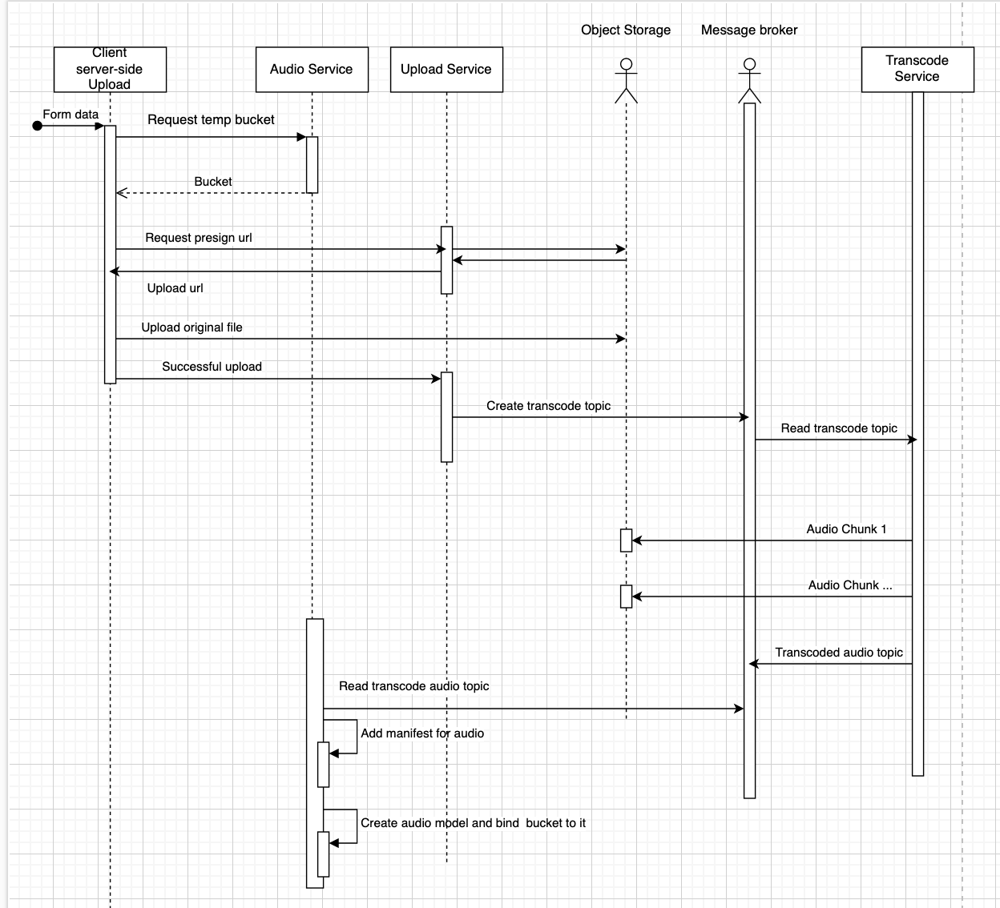

# stream-source
  - Features
    - [Audio transcoding](#audio-transcoding)
  
Dependencies:
  - ffmpeg
  - [shaka packager](https://github.com/shaka-project/shaka-packager)
  
## Audio transcoding

User upload audio file to Next.js server side than Next.js request upload url for that file and make PUT into minio presigned url. </br></br>
Than if upload success upload service produce the topic to kafka (Not yet implemented), that file should be transcoded through transcode service. </br></br>
The transcode service read topic from kafka and pass it into [TranscodeAudio](https://github.com/romashorodok/stream-source/blob/56a7ed2cd28c1a05873515cd8572a0124080b7b2/services/transcode/main.go#L143) function.
It start ffmpeg and listen stdout of process and pass bytes into named pipe(Linux). </br></br>
Than it starts shaka packager which listen name pipe and transform the audio bytes into blob files for MPEG-DASH streaming protocol.</br></br>
On final stage it take all produced files and upload it into minio object storage.

&nbsp;&nbsp;&nbsp;&nbsp;[Described code here](https://github.com/romashorodok/stream-source/blob/main/services/transcode/transcoder/service.go)



Produced output example for one audio file with different bit-rates in webm container type:
```xaml
<?xml version="1.0" encoding="UTF-8"?>
<!--Generated with https://github.com/google/shaka-packager version v2.6.1-634af65-release-->
<MPD xmlns="urn:mpeg:dash:schema:mpd:2011" xmlns:xsi="http://www.w3.org/2001/XMLSchema-instance" xsi:schemaLocation="urn:mpeg:dash:schema:mpd:2011 DASH-MPD.xsd" profiles="urn:mpeg:dash:profile:isoff-live:2011" minBufferTime="PT4S" type="dynamic" publishTime="2023-04-12T16:26:47Z" availabilityStartTime="2023-04-12T16:26:36Z" minimumUpdatePeriod="PT5S" timeShiftBufferDepth="PT1800S">
  <Period id="0" start="PT0S">
    <AdaptationSet id="0" contentType="audio">
      <Representation id="0" bandwidth="272249" codecs="vorbis" mimeType="audio/webm" audioSamplingRate="44100">
        <AudioChannelConfiguration schemeIdUri="urn:mpeg:dash:23003:3:audio_channel_configuration:2011" value="2"/>
        <SegmentTemplate timescale="1000000" initialization="b3046903-d789-4993-a943-5c92927f5208/0-076c3a3c-b232-40b3-a0ee-e404499a9af3.webm" media="b3046903-d789-4993-a943-5c92927f5208/$Number$-076c3a3c-b232-40b3-a0ee-e404499a9af3.webm" startNumber="1">
          <SegmentTimeline>
            <S t="0" d="4007000"/>
            <S t="4007000" d="4014000"/>
            <S t="8021000" d="3985000"/>
            <S t="12006000" d="3994000"/>
            <S t="16000000" d="4020000"/>
            <S t="20020000" d="4003000"/>
            <S t="24023000" d="3999000"/>
            <S t="28022000" d="3985000"/>
            <S t="32007000" d="3997000"/>
            <S t="36004000" d="4014000"/>
            <S t="40018000" d="3984000"/>
            <S t="44002000" d="4000000"/>
            <S t="48002000" d="4012000"/>
            <S t="52014000" d="3988000"/>
            <S t="56002000" d="4000000"/>
            <S t="60002000" d="4008000"/>
            <S t="64010000" d="4009000"/>
            <S t="68019000" d="3996000"/>
            <S t="72015000" d="3988000"/>
            <S t="76003000" d="3999000"/>
            <S t="80002000" d="4012000"/>
            <S t="84014000" d="3988000"/>
            <S t="88002000" d="4000000"/>
            <S t="92002000" d="4020000"/>
            <S t="96022000" d="3979000"/>
            <S t="100001000" d="4011000"/>
            <S t="104012000" d="3991000"/>
            <S t="108003000" d="4015000"/>
            <S t="112018000" d="3982000"/>
            <S t="116000000" d="4014000"/>
            <S t="120014000" d="4000000"/>
            <S t="124014000" d="3993000"/>
            <S t="128007000" d="3994000"/>
            <S t="132001000" d="4006000"/>
            <S t="136007000" d="3998000"/>
            <S t="140005000" d="4013000"/>
            <S t="144018000" d="743000"/>
          </SegmentTimeline>
        </SegmentTemplate>
      </Representation>
      <Representation id="1" bandwidth="124141" codecs="vorbis" mimeType="audio/webm" audioSamplingRate="44100">
        <AudioChannelConfiguration schemeIdUri="urn:mpeg:dash:23003:3:audio_channel_configuration:2011" value="2"/>
        <SegmentTemplate timescale="1000000" initialization="2f83f358-2757-4492-b970-fdc7c73c459d/0-3b46bec6-4a75-46eb-9195-49ced3f5ee68.webm" media="2f83f358-2757-4492-b970-fdc7c73c459d/$Number$-3b46bec6-4a75-46eb-9195-49ced3f5ee68.webm" startNumber="1">
          <SegmentTimeline>
            <S t="0" d="4001000"/>
            <S t="4001000" d="4020000"/>
            <S t="8021000" d="4000000"/>
            <S t="12021000" d="3988000"/>
            <S t="16009000" d="4005000"/>
            <S t="20014000" d="3997000"/>
            <S t="24011000" d="3994000"/>
            <S t="28005000" d="4002000"/>
            <S t="32007000" d="3994000"/>
            <S t="36001000" d="4006000"/>
            <S t="40007000" d="3995000"/>
            <S t="44002000" d="4004000"/>
            <S t="48006000" d="4000000"/>
            <S t="52006000" d="3999000"/>
            <S t="56005000" d="4014000"/>
            <S t="60019000" d="4000000" r="1"/>
            <S t="68019000" d="3993000"/>
            <S t="72012000" d="3994000"/>
            <S t="76006000" d="4003000"/>
            <S t="80009000" d="3994000"/>
            <S t="84003000" d="4017000"/>
            <S t="88020000" d="3999000"/>
            <S t="92019000" d="3991000"/>
            <S t="96010000" d="4000000" r="1"/>
            <S t="104010000" d="4011000"/>
            <S t="108021000" d="3982000"/>
            <S t="112003000" d="4011000"/>
            <S t="116014000" d="3988000"/>
            <S t="120002000" d="4003000"/>
            <S t="124005000" d="3997000"/>
            <S t="128002000" d="4020000"/>
            <S t="132022000" d="3993000"/>
            <S t="136015000" d="3994000"/>
            <S t="140009000" d="4000000"/>
            <S t="144009000" d="744000"/>
          </SegmentTimeline>
        </SegmentTemplate>
      </Representation>
      <Representation id="2" bandwidth="68659" codecs="vorbis" mimeType="audio/webm" audioSamplingRate="44100">
        <AudioChannelConfiguration schemeIdUri="urn:mpeg:dash:23003:3:audio_channel_configuration:2011" value="2"/>
        <SegmentTemplate timescale="1000000" initialization="6e9bc1dd-8ba3-47a4-8c11-75cf7fb22e81/0-355edf5f-6f3f-470f-bb7f-8e4a1347649f.webm" media="6e9bc1dd-8ba3-47a4-8c11-75cf7fb22e81/$Number$-355edf5f-6f3f-470f-bb7f-8e4a1347649f.webm" startNumber="1">
          <SegmentTimeline>
            <S t="0" d="4022000"/>
            <S t="4022000" d="3999000"/>
            <S t="8021000" d="4000000"/>
            <S t="12021000" d="3988000"/>
            <S t="16009000" d="4005000"/>
            <S t="20014000" d="3997000"/>
            <S t="24011000" d="3994000"/>
            <S t="28005000" d="3999000"/>
            <S t="32004000" d="4018000"/>
            <S t="36022000" d="3985000"/>
            <S t="40007000" d="3995000"/>
            <S t="44002000" d="4004000"/>
            <S t="48006000" d="4000000"/>
            <S t="52006000" d="3999000"/>
            <S t="56005000" d="4014000"/>
            <S t="60019000" d="4000000"/>
            <S t="64019000" d="3997000"/>
            <S t="68016000" d="3996000"/>
            <S t="72012000" d="3994000"/>
            <S t="76006000" d="4003000"/>
            <S t="80009000" d="3994000"/>
            <S t="84003000" d="4017000"/>
            <S t="88020000" d="3996000"/>
            <S t="92016000" d="3994000"/>
            <S t="96010000" d="4000000" r="1"/>
            <S t="104010000" d="4011000"/>
            <S t="108021000" d="3982000"/>
            <S t="112003000" d="4005000"/>
            <S t="116008000" d="3994000"/>
            <S t="120002000" d="4003000"/>
            <S t="124005000" d="3997000"/>
            <S t="128002000" d="4020000"/>
            <S t="132022000" d="3993000"/>
            <S t="136015000" d="3994000"/>
            <S t="140009000" d="4000000"/>
            <S t="144009000" d="744000"/>
          </SegmentTimeline>
        </SegmentTemplate>
      </Representation>
    </AdaptationSet>
  </Period>
</MPD>

```
